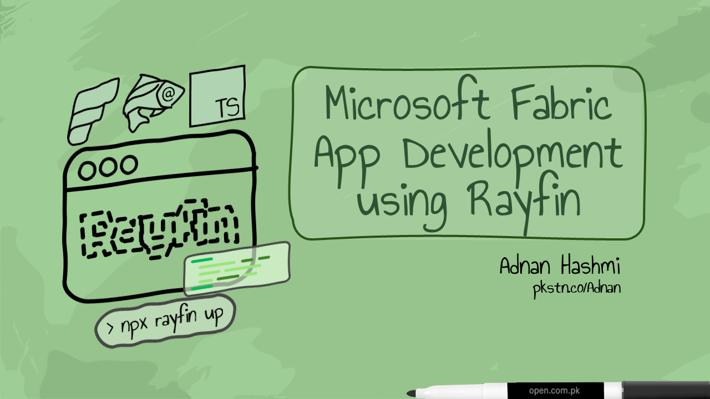

[README.md](README.md)

# Microsoft Fabric App Development using Rayfin

*`Outline/content to change often.`*

**WHY:** `To focus on imparting knowledge for creation of Fabric Apps using Rayfin and VS Code.`

**WHAT:** `Fast-paced course that focuses on generative AI and Rayfin to create Fabric Apps to deliver Microsoft Fabric analytics solutions (OLAP) to end-users.`

**HOW:** `Short videos ranging from a few mintues long to a maximum of 15 minutes (when necessary).`

**WHO:** `Fabric developers, solution architects, data engineers, full-stack developers, and technical professionals already familiar with Microsoft Fabric and TypeScript.`

---
<mark>[Video 0: About this course...](https://youtu.be/1dceEH7kouo)</mark>

# Foundation
## Module F.1: Fabric Apps and Rayfin Fundamentals

<mark>[Video F.1.1: Introduction to Microsoft Fabric Apps](https://youtu.be/VgqhLe3RJdY)</mark>
 <mark>[[Slides](https://github.com/adnanhashmi/learning/blob/main/fabric/rayfin/slides/01-FabricApps.pdf) | Notes | Obsidian Markdown]</mark>

**WHY:**
<small>`Reasons for creating Fabric Apps and where application development fits alongside Fabric's analytics and data workloads.`</small>

**WHAT:**
<small>`High-level view of Fabric Apps architecture, managed application services, Fabric workspace integration, and the relationship between application and analytical workloads.`</small>

**HOW:**
<small>`Explanation of the lifecycle from TypeScript source code to a deployed Fabric App.`</small>

<mark>[Video F.1.2: Understanding Rayfin](#)</mark>
 <mark>[Slides | Notes | Obsidian Markdown]</mark>

**WHY**
<small>`Reduction of custom development efforts for Fabric backend using Rayfin.`</small>

**WHAT**
<small>`Rayfin SDK, Rayfin CLI, data models, generated APIs, managed database, authentication, storage, and hosting.`</small>

**HOW**
<small>`Traceing TypeScript entity through schema generation, API exposure, client access, and eventual deployment.`</small>

<mark>[Video F.1.3: Overview of Gwadar Port Corporation (GPC) and PakTrax](#)</mark>
 <mark>[Slides | Notes | Obsidian Markdown]</mark>

**WHY**
<small>`Using a true-to-life case study to create a Fabric App using Rayfin.`</small>

**WHAT**
<small>`A high-level view of a shipment port authority in Gwadar (Pakistan) that handles inbound and outbound cargo transfers.`</small>

**HOW**
<small>`Designing an architecture and OLAP Dasboard using Rayfin.`</small>

<mark>[Video F.1.4: Fabric App Architecture](#)</mark>
 <mark>[Slides | Notes | Obsidian Markdown]</mark>

**WHY**
<small>`Developing a logical model of the complete application stack before writing code.`</small>

**WHAT**
<small>`Frontend, Rayfin client, GraphQL API, authentication, SQL database in Fabric, storage, static hosting, and Fabric workspace.`</small>

**HOW**
<small>`Mapping a web browser request through the Fabric App endpoint to its backend services.`</small>

<mark>[Video F.1.5: Fabric Apps versus Traditional Application Development](#)</mark>
 <mark>[Slides | Notes | Obsidian Markdown]</mark>

**WHY**
<small>`Identifying the process responsibilities Fabric Apps remove or simplify.`</small>

**WHAT**
<small>`Comparison of external databases, REST/GraphQL services, authentication, hosting, and infrastructure with Rayfin's managed approach.`</small>

**HOW**
<small>`Mapping conventional application tiers to equivalent Fabric Apps services.`</small>

---
