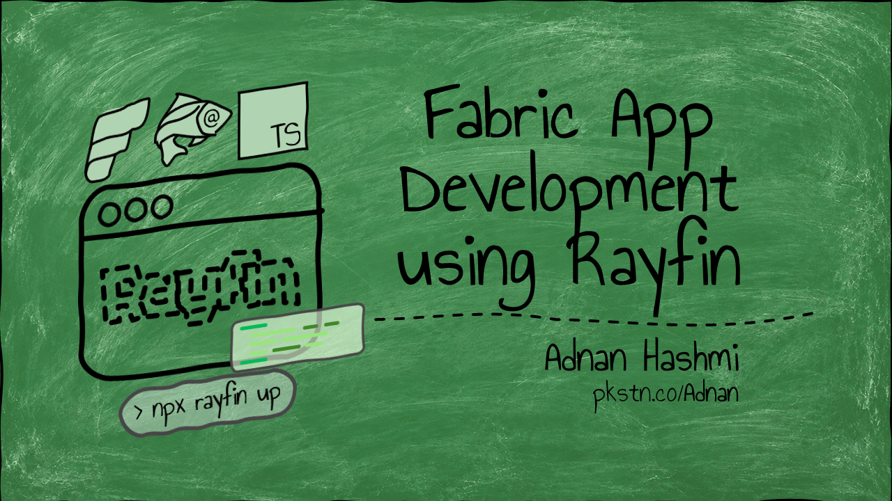

[README.md](README.md)

# Microsoft Fabric App Development using Rayfin

*`Outline/content to change often.`*

**WHY:** `To focus on imparting knowledge for creation of Fabric Apps using Rayfin and VS Code.`

**WHAT:** `Fast-paced course that focuses on generative AI and Rayfin to create Fabric Apps to deliver Microsoft Fabric analytics solutions (OLAP) to end-users.`

**HOW:** `Short videos ranging from a few mintues long to a maximum of 15 minutes (when necessary).`

**WHO:** `Fabric developers, solution architects, data engineers, full-stack developers, and technical professionals already familiar with Microsoft Fabric and TypeScript.`

---

<mark>[Video 0: About this course...](https://youtu.be/1dceEH7kouo)</mark>
 <mark>[[Slides](https://github.com/adnanhashmi/learning/blob/main/fabric/rayfin/slides/00-Rayfin.pdf) | [Transcription](https://github.com/adnanhashmi/learning/blob/main/fabric/rayfin/transcription/00-Transcript.md)]</mark>

---

# Foundation

[Module F.1: Fabric Apps and Rayfin Fundamentals](https://github.com/adnanhashmi/learning/blob/main/fabric/rayfin/F1.md)

[Module F.2: Rayfin Development](https://github.com/adnanhashmi/learning/blob/main/fabric/rayfin/F2.md)

Module F.3: Creating the First Fabric App

---

# Beginner

Module B.4: Rayfin Programming Model

Module B.5: Database and Schema Management

Module B.6: Data APIs and GraphQLData APIs and GraphQL

Module B.7: Frontend Development

Module B.8: Authentication and Authorization

---

# Intermediate

Module I.9: Configuration and Hosting

Module I.10: Deployment to Microsoft Fabric

Module I.11: Fabric-Native Application Architecture

---

# Advanced

Module A.12: Advanced Application Design

Module A.13: Source Control, Team Development, and Application Lifecycle

Module A.14: Troubleshooting and Diagnostics

Module A.15: Building an Enterprise Fabric App
