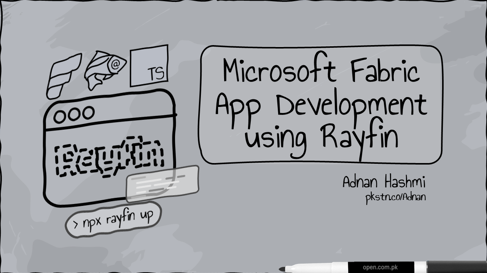

<mark>[**View Course Outline/Contents**](OUTLINE.md)</mark>

[https://pkstn.co/Rayfin](https://pkstn.co/Rayfin) `Short URL for this page`

[https://www.youtube.com/playlist?list=PLRUijDzc8MGQ](https://www.youtube.com/playlist?list=PLRUijDzc8MGQ) `YouTube Playlist`

[GPC](_GPC.md) `Gwadar Port Corporation (Example Org)`

> [!NOTE]
> Outline has undergone several revisions after it was first generated using AI.

---

> AI Prompt

The initial course outline was generated using OpenAI ChatGPT with the following prompt:

***Generate an outline for 'Microsoft Fabric App Development using Rayfin' which comprises of bite-sized videos, each having separate sections titled WHY, WHAT. and HOW. The course is meant for technical people with knowledge and experience of Microsoft Fabric and TypeScript, and is intended to impart detailed information of Fabric App development from the very basic to an advanced level. Do not hallucinate when generating your response.***
