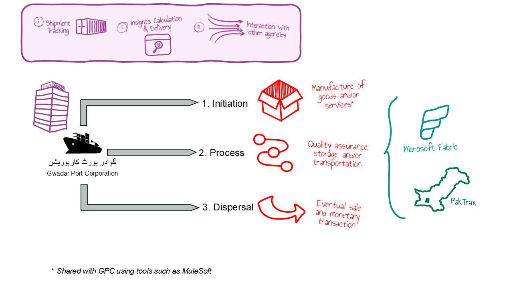

<mark>[**View Course Outline**](OUTLINE.md)</mark>

# Gwadar Port Corporation (GPC)

## WHY
Gwadar Port Corporation (GPC) existence is geared towards handling inbound and outbound freight by the sea port it manages in Gwadar, Pakistan, and creates, consumes, and reports on data to its stakeholders, both internal and external.

## WHAT
Gwadar Port Corporation (GPC) is a fictitious shipment authority that manages transfer and storage of goods between manufacturers and consuming organizations, handled by shipping companies, and monitored by various government and non-government agencies.

## HOW
Bulk of GPC business aspects are handled inside Microsoft Fabric and the data is reported using Microsoft Fabric and [PakTrax](_PakTrax.md).

<mark>[**View Course Outline**](OUTLINE.md)</mark>
