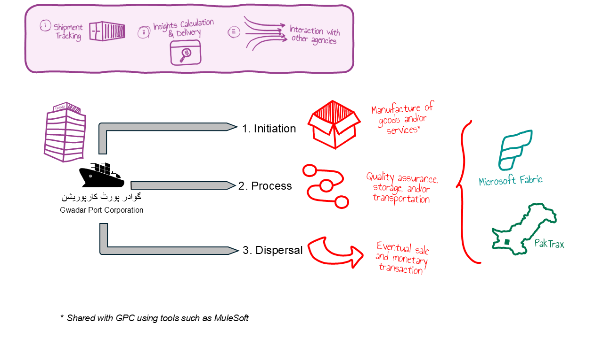

# PakTrax

## WHY
A Fabric App created using Rayfin to allow end-users to access Microsoft Fabric data using a web application in their browser eliminating the need to sift through Microsoft Fabric workspaces, artifacts, and data stores (OneLake, Lakehouse, KQL Database, etc).

In addition, all security is driven by OneLake Security, instead of defining it separately in the web application.

## WHAT
PakTrax is used by [Gwadar Port Corporation (GPC)](_GPC.md), a fictitious shipment authority to deliver analytics and insights to stake-holders and end-users (internal to the organization).

Code generation for the Fabric App results in TypeScript (by AI that uses GitHub Copilot or Claude Code) and deployed in a workspace as a Microsoft Fabric item. Users may also access static content of the Fabric App using a public URL.

## HOW
Rayfin in VS Code generates the TypeScript code used by the PakTrax which is further refined by a developer to incorporate business requirements. Once the application is ready to be rolled-out to users, it is deployed through a command issued in the VS Code Terminal window.
